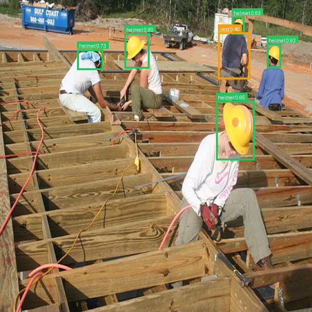

# Детекция СИЗ на промышленных площадках

Проект по компьютерному зрению для детекции средств индивидуальной защиты на изображениях с промышленных площадок.  
Модель определяет строительные каски, сигнальные жилеты и головы.

## Что внутри

- проверка структуры датасета;
- небольшой анализ разметки;
- обучение YOLO-модели для object detection;
- веб-интерфейс на Streamlit;
- API на FastAPI;
- Docker для локального запуска.

## Пример задачи

На вход подается фотография с промышленной площадки.  
На выходе приложение показывает найденные объекты, уверенность модели и рамки на изображении.



Классы:

```text
helmet - каска
vest   - жилет
head   - голова
```

## Модель

Используется YOLO11n - компактная модель для детекции объектов.  
Она подходит для локального запуска, быстрого инференса и удобного развертывания в Docker.

Результаты на валидации:

```text
Precision: 0.858
Recall:    0.809
mAP50:     0.863
mAP50-95:  0.513
```

Финальные веса модели лежат в проекте:

```text
models/ppe_yolo11n_baseline.pt
```

## Как запустить через Docker

```bash
docker compose up --build
```

После запуска открыть:

```text
http://localhost:8501
```

Остановить контейнер:

```bash
docker compose down
```

## Как запустить без Docker

Установить зависимости:

```bash
pip install -r requirements.txt
```

Запустить Streamlit:

```bash
streamlit run app/streamlit_app.py
```

## Структура проекта

```text
app/                 веб-приложение и API
src/                 скрипты для анализа, обучения и проверки
data/data.yaml       описание классов для YOLO
models/              сохраненная модель для демо
notebooks/           ноутбук с первичным анализом
Dockerfile           сборка Docker-образа
docker-compose.yml   локальный запуск приложения
```

## Что я сделал в проекте

1. Подготовил датасет в формате YOLO.
2. Проверил количество изображений и файлов разметки.
3. Посмотрел распределение классов.
4. Дообучил YOLO11n на задачу поиска СИЗ.
5. Сделал локальное приложение для загрузки изображения и просмотра результата.
6. Добавил сохранение предсказаний и простую обратную связь.
7. Упаковал проект в Docker.

## Что можно улучшить

- обучить модель дольше и сравнить несколько версий YOLO;
- добавить больше изображений с редкими случаями;
- улучшить логику проверки нарушений, например "человек без каски";
- развернуть демо онлайн.

## Примечание

Сырые данные и папки с обучением не добавлены в GitHub, чтобы не раздувать репозиторий.  
В репозитории лежит только код, конфигурация и легкая модель для демонстрации.
